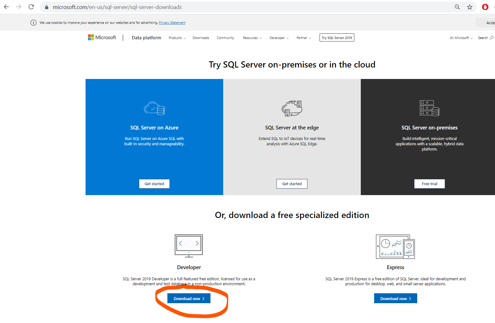
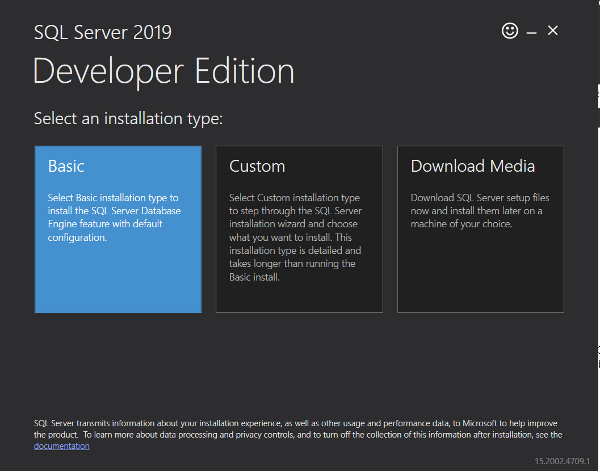
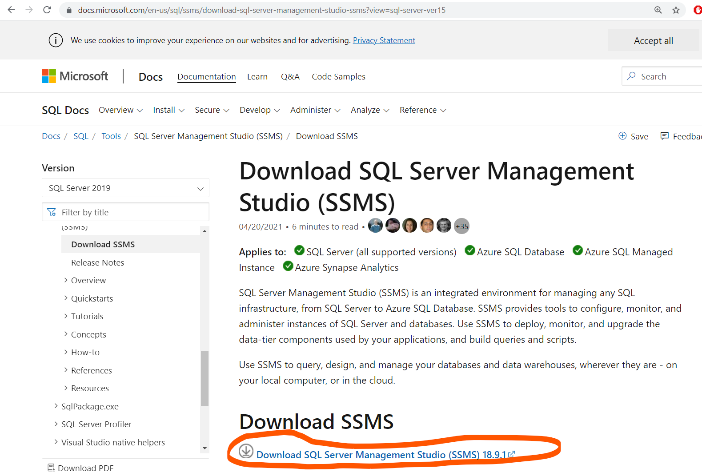
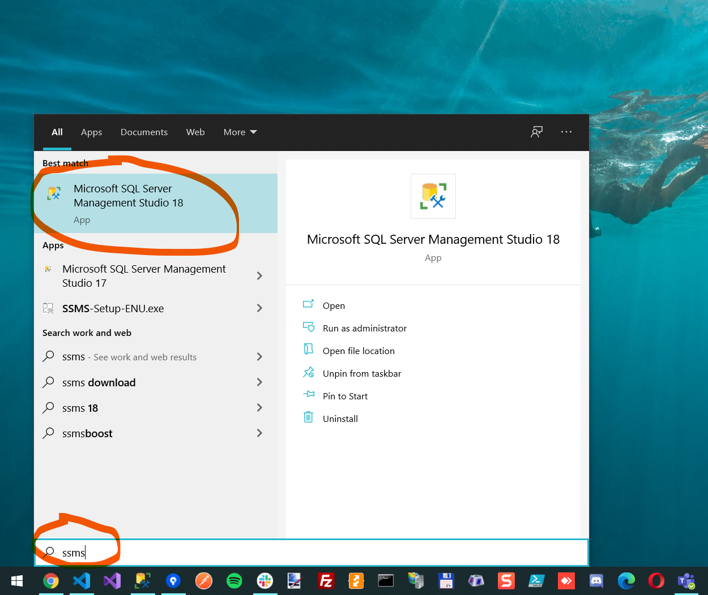
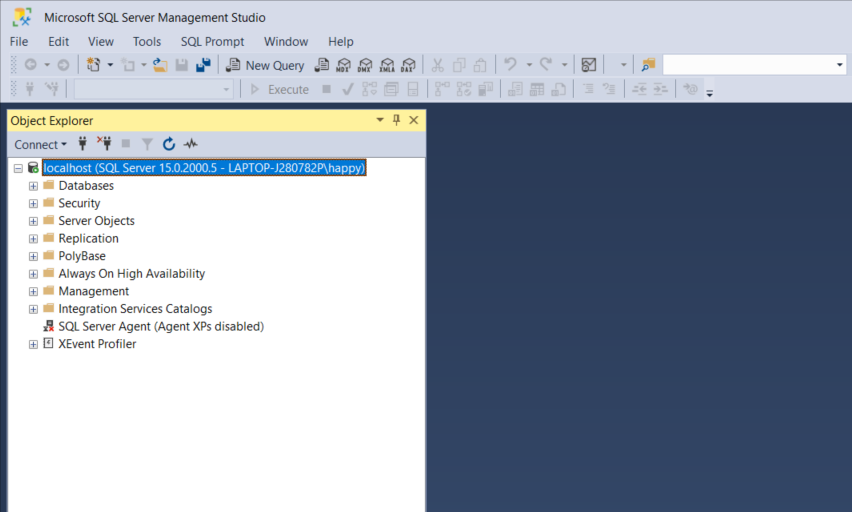

# SQL Server 2019 Developer

Download and install SQL Server 2019 Developer using the following link 

https://www.microsoft.com/en-us/sql-server/sql-server-downloads 

In the installation wizard, choose **Basic**. Then just press next, next, next... 

...finally close the window

# SQL Server Management Studio

Download and install SQL Server Management Studio using the following link 

https://docs.microsoft.com/en-us/sql/ssms/download-sql-server-management-studio-ssms

# Try it out

Open SQL Server Management Studio by pressing the Window Button and write **ssms**

Write **localhost** as Server name and then press Connect:

If it works it should look something like this:

