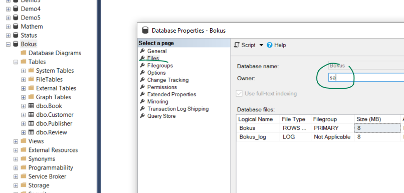

# Diagram

If you get error when opening diagram in SSMS, like:

    Could not obtain information about Windows NT group/user '...', error code 0x54b. (Microsoft SQL Server, Error: 15404)

then right click on the database, choose Properties and change **Owner** to **sa**

