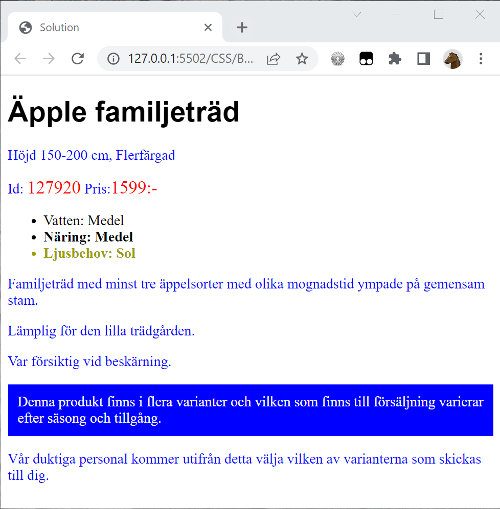

# Exercise

Start with **Start.html**

Add CSS within the style-tag to create the following page. Don't modify any HTML-code with the body-tag.

Hint, the following styles is used:

    background-color: blue;
    border:solid 1px;
    color: blue;
    color:#9d9d00
    color:red;
    color:white
    font-family: Arial;
    font-size:20px;
    font-weight: bold;
    padding:10px;