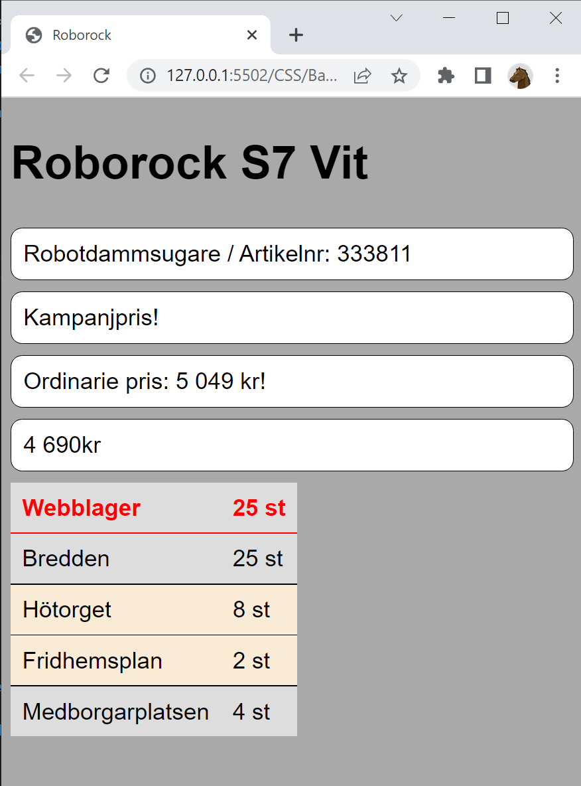

# Exercise

Start with **Start.html**

Follow the instructions in the file and create this page:

(You may need to google a bit to find some styles)

Hint, here is the properties used in this exercise:

    background-color: #ddd;
    background-color: antiquewhite;
    background-color: darkgray;
    background-color: white;
    border-bottom: solid 1px;
    border-collapse: collapse;
    border-radius: 10px;
    border: none
    border:solid 1px;
    color:red;
    font-family: Arial;
    font-size: 20px;
    font-size: 40px;
    font-weight: bold;
    margin: 10px 0;
    padding: 10px;
    padding:10px;