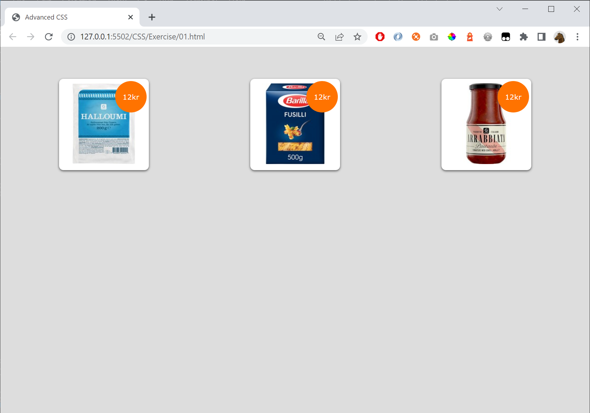
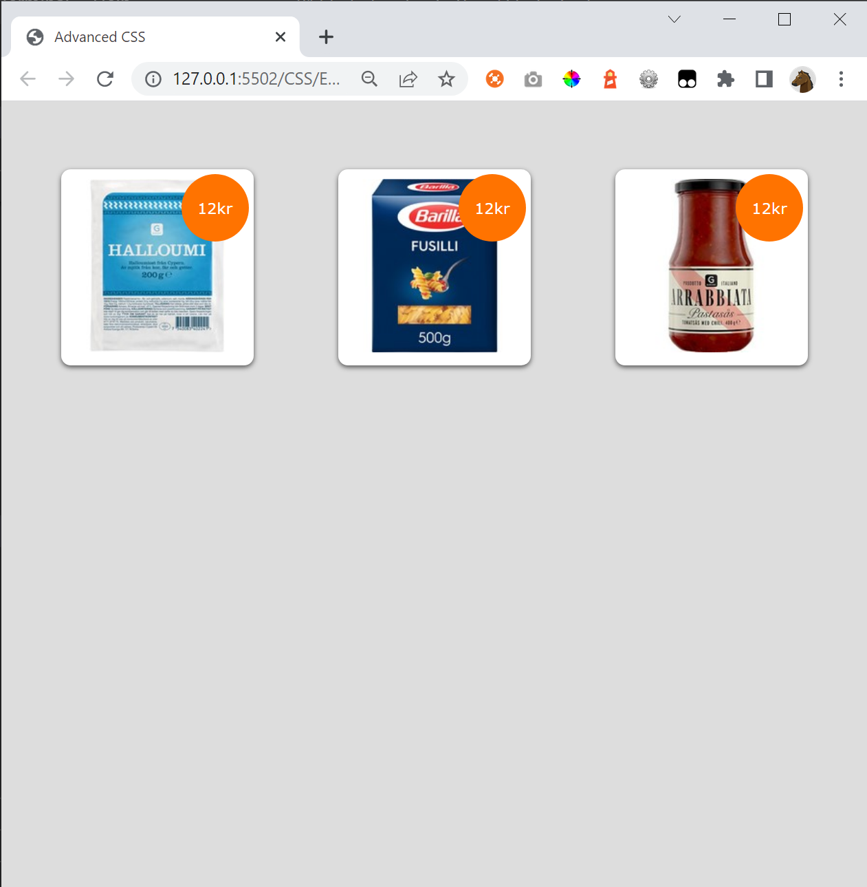
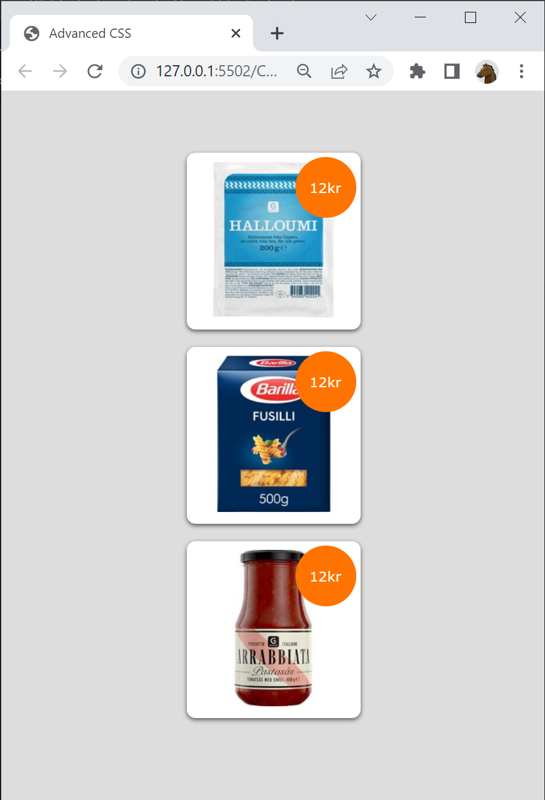

# CSS Exercise

Create a responsive webpage that look different depending on the size of the window.

Start with **Start.html** and download the **Products**-folder

Skip the orange price-bubble (that belongs to the extra exercise)

# Extra 1

Add the orange price-bubble.

# Extra 2

Do the exercise again but start with an empty HTML and don't use the hints.

# Hint

These css-properties is used

    align-items: center;
    background-color: rgb(255, 115, 0);
    background: #ddd;
    background: white;
    border-radius: 10px;
    box-shadow: 0 2px 5px #535353;
    color: white;
    display: flex;
    flex-direction: column;
    gap:20px;
    height: 70px;
    justify-content: center;
    justify-content: space-around;
    margin-left:10px
    margin-top: 50px;
    padding:10px;
    position: absolute;
    position:relative;
    right: 5px;
    top: 5px;
    width: 70px;

