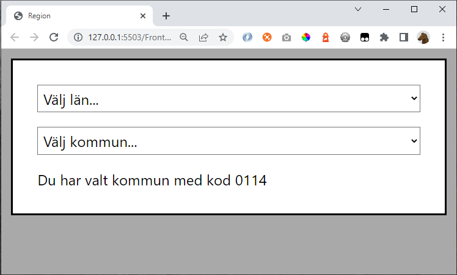

# Exercise

Create this design using HTML and CSS:

The first dropdown should contain:

    Välj län...
    Stockholms län
    Uppsala län
    Västra Götalands län

The second dropdown should contain:

    Välj kommun...
    0114 Upplands Väsby
    0115 Vallentuna
    0117 Österåker

Make the box and selectboxes follow the width of the window.

