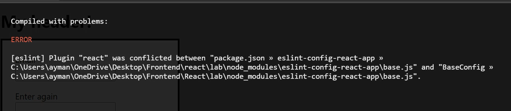
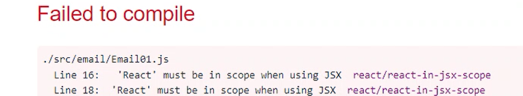

## Problem

Can't run npx

## Solution

Restart Visual Studio Code

--

## Problem

Can't run node

## Solution

Install node at c:\ (not another disk)

---

## Problem

## Solution

Before running 
    
    yarn start
    
...look at the casing of the path (c:\MyFOlder\...)

---

## Problem

## Solution

The error message is not correct. It's Eslint that creates the error. Disable it in config file or add a line in index.js:

    /* eslint "react/jsx-uses-react": "off", "react/react-in-jsx-scope": "off" */

---